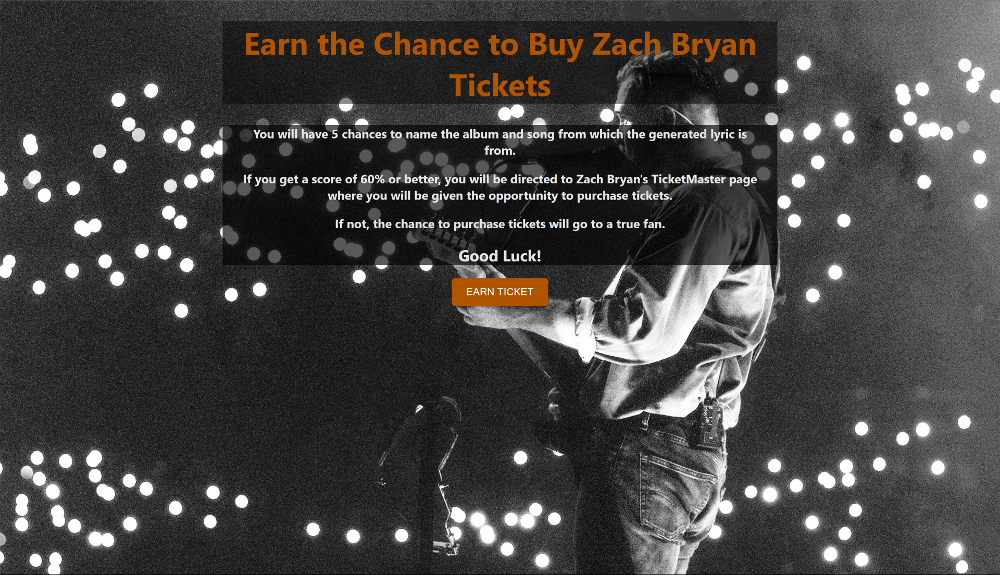
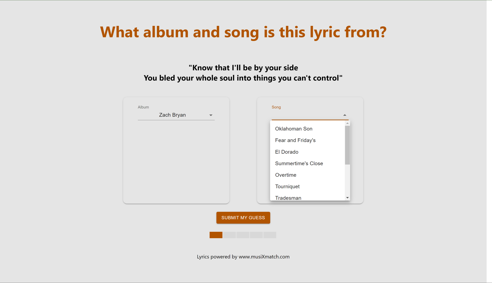

# Ticket Earner

## Program Description:
This program was created in light of recent issues with Ticketmaster for artists such as Zach Bryan and Taylor Swift going on tour. Simply put, resellers and bots are being blamed for the lack of access of tickets for the artists' true fans and exponentially driving up prices. This website is one version of a solution for this problem by requiring users to match a random Zach Bryan lyric to its corresponding song and album. If the user gets 60% or better, they are redirected to Zach Bryan's Ticketmaster page to be given the opportunity to purchase tickets. If not, they lose that opportunity.

It can be accessed [here!](http://3.12.30.87/)

*Song dropdown list generated based on selected album*

## Technologies Used:
This program was developed using a React front-end with some components from [Ant Design](https://ant.design/) and [Material UI](https://mui.com/) and styled using [Sass](https://sass-lang.com/). It connects with a Node.js backend using the Express framework.

This application was also containerized into client and server containers using Docker before being run on an AWS EC2 instance, using docker networks as well nginx as a reverse proxy for communication.

## How to Run:
**Important:** *You will need to create a developer account for Musixmatch to run this program.* 

#### On the Cloud
1. Create a developer account from https://developer.musixmatch.com/
2. Replace `api_key` in `server/index.js` with your API Key
3. Create an [AWS EC2 Instance](https://aws.amazon.com/ec2/). A free micro.t2 provides enough processing power if you can build the containers locally. If you need to build them within the EC2 instance, use a t2.small because you will need the extra GB of RAM.
4. Configure the inbound rules under the security tab to allow for:
- HTTPS
- SSH
- Custom TCP on port 3000
- Custom TCP on port 8000
- HTTP
5. Create an elastic IP address in AWS and associate it with your instance
6. Update `proxy pass` in `client/nginx/default.conf` with your elastic IP address as well as `ELASTIC.IP` in `client/src/axios.js`
7. In the root folder, run `docker compose up --build`
8. Visit your IP address!

#### Locally w/o Docker
1. Create a developer account for musixmatch
2. Create `server/.env` and put `API_KEY=YOUR_API_KEY`
3. Change the base URL in `client/src/axios.js` to `http//:localhost:8000`
4. `cd` into `client` and run `npm install`
5. `cd` into `server` and run `npm install`
6. `cd` back into `client` and run `npm start`
7. `cd` back into `server` and run `npm start`
8. Visit localhost:3000

## Future Steps
This is currently just an MVP build. The next steps for this project include:
* Implementing the `usePlayable` hook to check if the user has already played in the current browser window and not allow them to play again (ie don't let them reload the page and replay if they mess up)
* Setting up a domain for the website
* Implementing GitHub actions as a CI/CD pipeline
* Implementing Docker secrets so that values in `server/index.js` can be const again
  

##### Developer: Bobby Miller
##### Email: robert.p.miller@vanderbilt.edu
